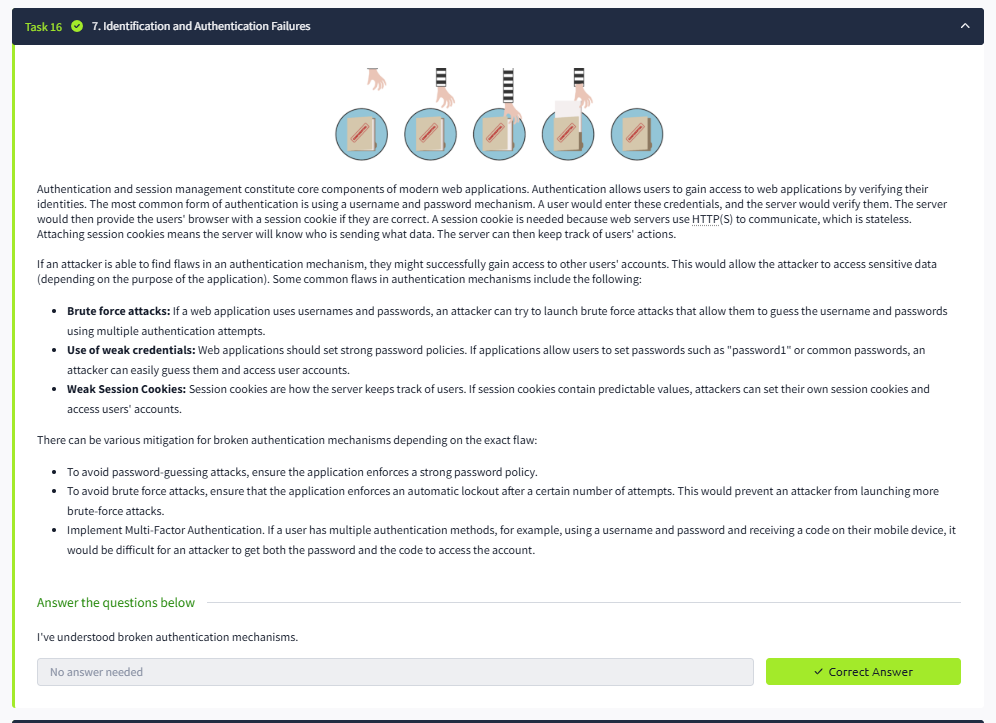

# Lab Report: OWASP Top 10 – Authentication Failures

## Summary of the Target
This lab highlights flaws in authentication mechanisms, such as weak passwords, missing brute-force protection, and predictable session cookies.

## Exploitation Steps
- **Reconnaissance** – Attempted multiple login attempts and analyzed session cookies.  
- **Exploit** – Conducted brute force attack with weak credentials (`admin:password123`).  
- **Impact** – Successfully logged in as an administrator, bypassing authentication controls.  

## Findings with Screenshots
- Weak password policy and lack of brute-force protection.  
- Predictable session cookie values.  
- **Impact:** Unauthorized access to sensitive accounts.  

## Remediation Advice
- Enforce strong password policies and complexity requirements.  
- Implement account lockout after multiple failed attempts.  
- Use secure session management and enable Multi-Factor Authentication (MFA).  

