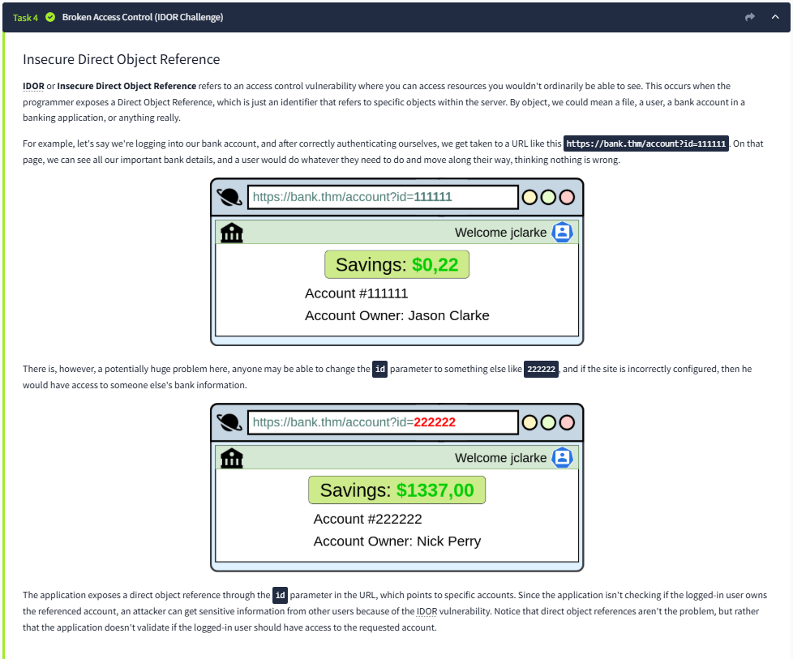

# Lab Report: OWASP Top 10 – Broken Access Control

## Summary of the Target
The lab simulates a vulnerable web application with weak access control mechanisms.  
The goal is to demonstrate how attackers can access unauthorized data.

---

## Exploitation Steps
1. **Reconnaissance**  
   - Identified endpoints and tested for unauthorized access.  

2. **Exploit**  
   - Directly accessed restricted content by modifying the URL.  
   - No authentication check was enforced.  

3. **Privilege Escalation**  
   - Gained access to sensitive user information without proper authorization.  

---

## Findings with Screenshots
- **Vulnerability:** Broken Access Control (IDOR – Insecure Direct Object Reference)  
- **Impact:** Unauthorized users can access sensitive data without authentication.  

### Screenshot:

---

## Remediation Advice
- Enforce strict role-based access controls.  
- Validate session tokens on every request.  
- Implement least privilege principle.  
- Conduct regular access control testing.  

