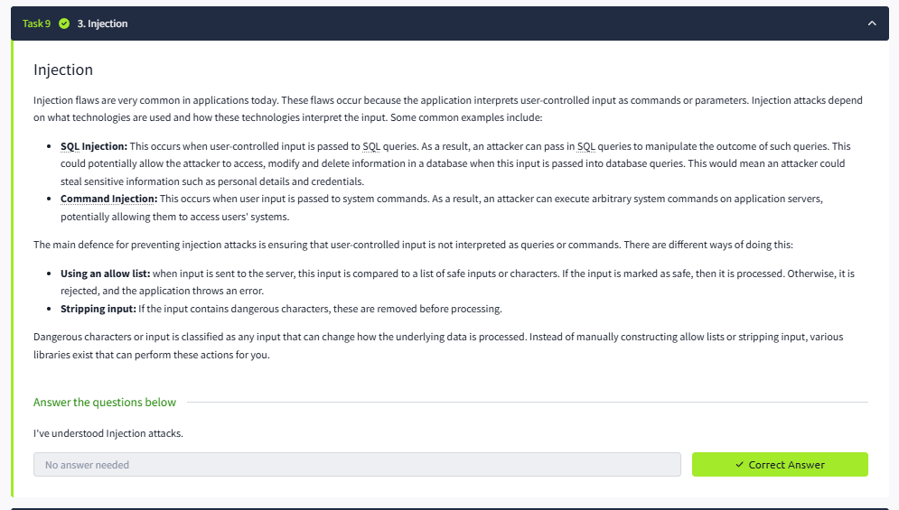

# Lab Report: OWASP Top 10 – Injection

## Summary of the Target
This lab demonstrates injection flaws where user-controlled input is passed directly into database queries or system commands.

## Exploitation Steps
1. **Reconnaissance** – Interacted with the web application input fields. Identified parameters vulnerable to SQL queries and command execution.
2. **Exploit** – Injected malicious payloads such as `' OR '1'='1` for SQL injection and `; ls` for command injection.
3. **Privilege Escalation** – Used injection to gain unauthorized access to sensitive information and system-level commands.

## Findings with Screenshots
- Found **SQL Injection** and **Command Injection** vulnerabilities.
- **Impact:** Full database compromise and remote code execution.
- 

## Remediation Advice
- Use parameterized queries (prepared statements).
- Validate and sanitize user input.
- Implement strict allow-lists for system commands.
