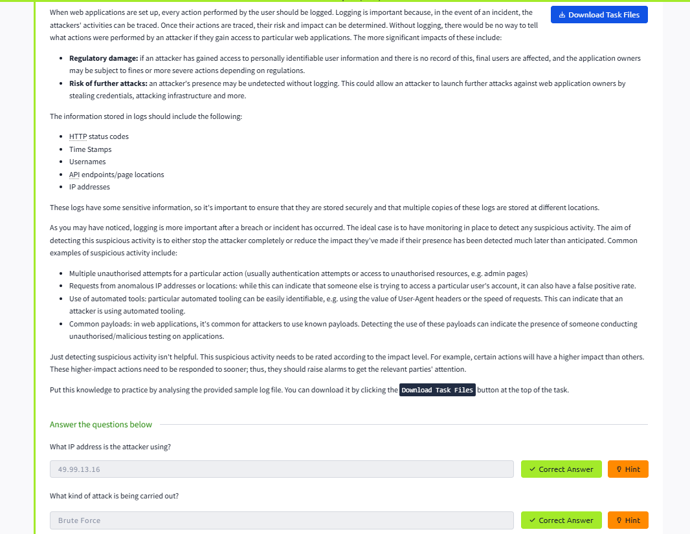

# Lab Report: OWASP Top 10 – Security Misconfiguration

## Summary of the Target
This lab demonstrates how default configurations, verbose error messages, and unnecessary services lead to vulnerabilities.

## Exploitation Steps
1. **Reconnaissance** – Identified open ports, default admin panels, and verbose server responses.
2. **Exploit** – Accessed default credentials and debug messages revealing system paths.
3. **Impact** – Gained unauthorized access to system information and potential privilege escalation paths.

## Findings with Screenshots
- Misconfigured admin panel accessible to unauthenticated users.
- Verbose error messages leaking stack traces.
- **Impact:** Information disclosure and easier exploitation.
- 

## Remediation Advice
- Disable default accounts and unnecessary services.
- Harden server configurations and apply security baselines.
- Suppress verbose error messages in production environments.
